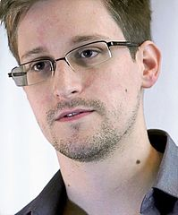

!SLIDE 

# Sicurezza

TODO: define

* evitare che le proprie comunicazione vengono spiate
* evitare che i file sul proprio computer vengono letti

* proteggere i propri soldi - acquisti online
* proteggere i propri account nei siti Internet

!SLIDE

# Privacy

* l'avversario, purtroppo, e' di solito un governo - il nostro o uno straniero
  alleato o meno con il nostro
* "Non ho nulla da nascondere" - la privacy e' un diritto umano (cit?)

!SLIDE

# Chi ci spia?

# L'NSA

# Edward Snowden #

TODO

